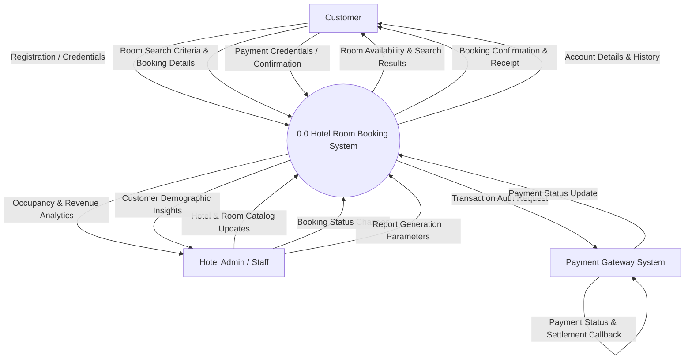

# Data Flow Diagram (DFD) - Hotel Room Booking System

This document contains Data Flow Diagrams at Level 0 (Context Diagram) and Level 1 (Detailed Subsystems) for the Hotel Room Booking System.

---

## 1. DFD Level 0 (Context Diagram)

The Level 0 Context Diagram displays the boundary of the Hotel Room Booking System and its interactions with external entities.



---

## 2. DFD Level 1 (Detailed System Decomposition)

Level 1 breaks down the system into core sub-processes: Authentication, Room Search & Availability, Booking Management, Payment Gateway Integration, Customer Management, and Reporting Engine.

```mermaid
graph TD
    %% Entities
    Customer[Customer]
    Admin[Hotel Admin]
    Gateway[Payment Gateway]

    %% Processes
    P1(("1.0 User Auth & Profile"))
    P2(("2.0 Room Search & Availability Engine"))
    P3(("3.0 Booking Transaction Engine"))
    P4(("4.0 Payment Gateway Adapter"))
    P5(("5.0 Reporting & Analytics Engine"))

    %% Data Stores
    D1[("DS-1 Users Table")]
    D2[("DS-2 Hotels & Rooms Table")]
    D3[("DS-3 Bookings Table")]
    D4[("DS-4 Payments Table")]

    %% Interactions Process 1
    Customer -->|Login & Profile Info| P1
    P1 -->|Read/Write User Data| D1
    D1 -->|User Profile Details| P1
    P1 -->|Auth Token & Profile View| Customer

    %% Interactions Process 2
    Customer -->|Dates, Guests & Location| P2
    P2 -->|Query Rooms & Locks| D2
    P2 -->|Check Booked Dates| D3
    D2 -->|Room Details & Pricing| P2
    D3 -->|Existing Bookings| P2
    P2 -->|Real-time Available Rooms| Customer

    %% Interactions Process 3
    Customer -->|Booking Submission| P3
    P3 -->|Reserve Room & Create Booking| D3
    D3 -->|Pending Booking ID| P3
    P3 -->|Initiate Payment Request| P4

    %% Interactions Process 4
    P4 -->|Payment Request (Card/Wallet/Bank)| Gateway
    Gateway -->|Transaction Result| P4
    P4 -->|Update Payment Record| D4
    P4 -->|Update Booking Status: Confirmed| D3
    P4 -->|Confirmation & Receipt| Customer

    %% Interactions Process 5
    Admin -->|Report Filters & Date Range| P5
    P5 -->|Query Booking Metrics| D3
    P5 -->|Query Revenue Records| D4
    P5 -->|Query User Demographics| D1
    P5 -->|Occupancy, Revenue & Demographic Visuals| Admin
```
