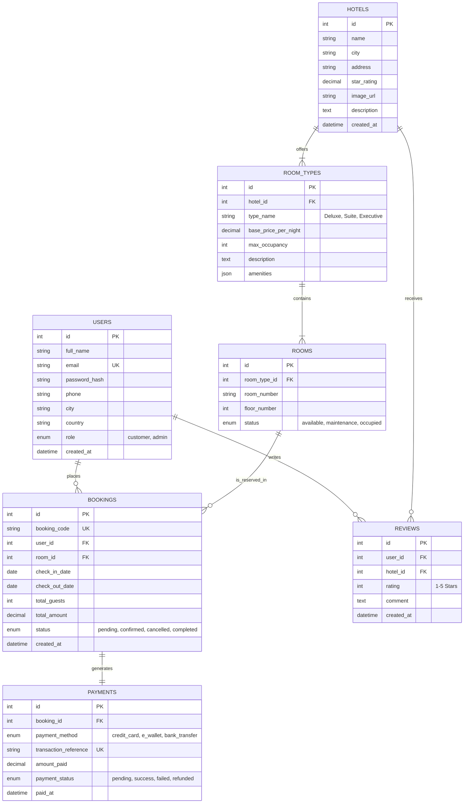

# Entity Relationship Diagram (ERD) - Hotel Room Booking System

This document describes the relational database structure for the Hotel Room Booking System using Mermaid ERD notation.

## Mermaid ERD Diagram

## Relational Constraints & Keys
1. `HOTELS` (1) -> `ROOM_TYPES` (N): A hotel branch offers multiple room types.
2. `ROOM_TYPES` (1) -> `ROOMS` (N): A room type categorizes specific physical room numbers.
3. `USERS` (1) -> `BOOKINGS` (N): A registered customer can create multiple room reservations over time.
4. `ROOMS` (1) -> `BOOKINGS` (N): A specific room can have multiple non-overlapping booking date ranges.
5. `BOOKINGS` (1) -> `PAYMENTS` (1): Each booking has a corresponding payment record.
6. `USERS` (1) -> `REVIEWS` (N) & `HOTELS` (1) -> `REVIEWS` (N): Customers can review hotel stays.
